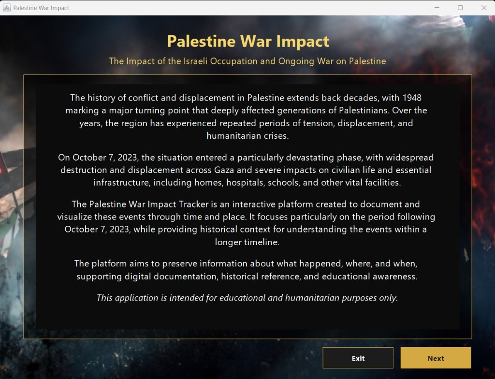
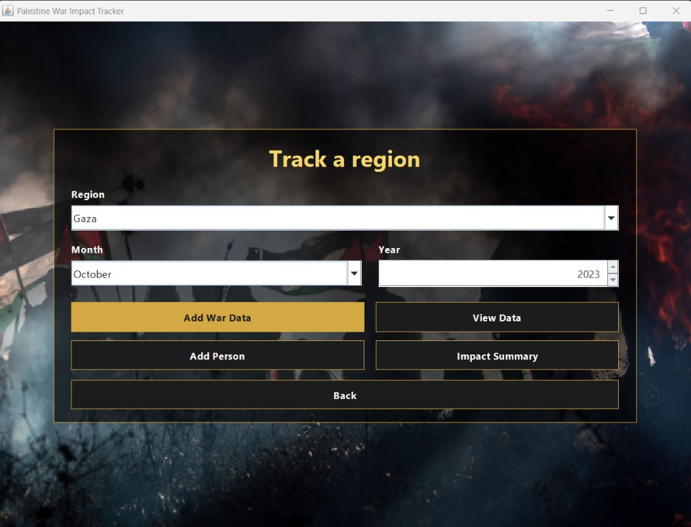

# Palestine War Impact Tracker

A Java desktop application for a **Java programming course**. It documents the humanitarian impact of the war on Palestine by region, month, and year, and keeps a record of people, healthcare, education, and border status.

The project is built with **Java 17** and **Swing**. It is intended for educational and humanitarian use.

## Screens

The welcome screen introduces the historical context, from 1948 through the period that intensified after 7 October 2023.



The main screen is where a region, month, and year are chosen before adding data, viewing records, registering a person, or opening the impact summary.



## What the application does

- Records war-impact figures for Gaza, the West Bank, and Jerusalem: martyrs, wounded, prisoners, hospitals, untreated patients, schools, displaced students, and border status.
- Stores named records for a martyr, a wounded person, or a prisoner, tied to a region and a date.
- Looks up, edits, and deletes a saved record.
- Summarizes the most and least affected regions, martyrs by region, and border status.
- Accepts years from **1948** through the current year. An earlier year is rejected with an error.

## Project structure

```text
src/
  App.java                    Entry point
  UiTheme.java                Shared fonts, colors, and controls
  WelcomeScreen.java          Introduction
  MainScreen.java             Region, month, and year
  AddDataScreen.java          Impact figures
  AddPersonScreen.java        Individual records
  ViewDataScreen.java         Lookup, edit, and delete
  MostAffectedAreaScreen.java Summary
  RegionData.java             Stored record for one place and date
  WarVictim.java              Person record
  WarStats.java               Casualty figures
  HealthCareImpact.java       Healthcare figures
  EducationImpact.java        Education figures
  BorderStatus.java           Border state
  DataAnalyzer.java           Summary calculations
resources/
  background.jpg              Background used on the welcome and main screens
```

All classes are in the package `First`.

## Requirements

- JDK 17 or newer

## Run

From the project folder:

```bash
javac --release 17 -d bin src/*.java
mkdir -p bin/First
cp resources/background.jpg bin/First/background.jpg
java -cp bin First.App
```

On Windows PowerShell:

```powershell
javac --release 17 -d bin src\*.java
New-Item -ItemType Directory -Force -Path bin\First | Out-Null
Copy-Item -Force resources\background.jpg bin\First\background.jpg
java -cp bin First.App
```

The main class is `First.App`. In Eclipse, set the project JDK to 17 and run `App.java`.

## Course

This repository is the project for a Java course. It practices object-oriented design, a graphical user interface, input validation, and organizing an application across multiple screens and classes.
